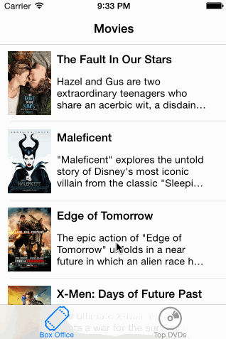

# RottenTomatoes App

Time spent: not sure exactly, probably around 10 hours

Completed user stories:
 * [x] Required: User can view a list of movies from Rotten Tomatoes.  Poster images must be loading asynchronously.
 * [x] Required: User can view movie details by tapping on a cell
 * [x] Required: User sees loading state while waiting for movies API.  You can use one of the 3rd party libraries here.
 * [x] Required: User sees error message when there's a networking error.  You may not use UIAlertView to display the error.  See this screenshot for what the error message should look like: network error screenshot.
 * [x] Required: User can pull to refresh the movie list.
 * [x] All images fade in (optional)
 * [x] For the large poster, load the low-res image first, switch to high-res when complete (optional)
 * [x] All images should be cached in memory and disk. In other words, images load immediately upon cold start (optional).
 * [x] Add a tab bar for Box Office and DVD. (optional)

Notes:

I included some inline questions on iOS style/conventions, indicated by "// QUESTION". Also I've never coded in Objective C before, so it would be cool to validate that I'm doing everything correctly. Thanks!

Walkthrough of all user stories:

